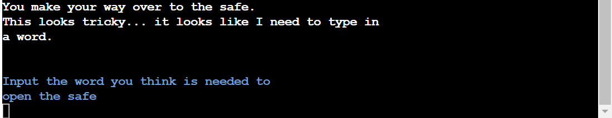

# Hallow Halls Murder Mystery Game

- Hallow Halls is a murder mystery game. The game is set at a very wealthy private pyschiatric Hospital called Hallow Halls. The aim of the game is to find out who was the murderer.
As you play the game, you will come across new clues and items that will help you figure out who is the killer. You will be choosing which room you want to explore next by typing the room into the terminal provided. Some rooms will contain items that will be added to your inventory. You will need all 8 items before guessing who you think is the murderer. Read every detail carefully as it may or may not be very important to solve the case... you might even have to solve a little riddle along the way. I recommend users to play some sort of detective music in the background while playing the game.

The live link can be found here - [Link to live project here](https://murder-mystery-pp3-a34ca40ad052.herokuapp.com/)

## Goals of this project

### Site owner goals

- To make a fun easy-to-playy game for the user.

- To make the user feel like they are in a murder mystery game.

- To provide an easy-to-navigate game.

- To challenge the users and not make the game to easy to solve.

- For the user to get immersed into the Hallow Halls experience.

### External user goals

- To enjoy a murder mystery game.

- To escape normality and immerse yourself into another reality.

- To solve a riddle, memorize clues and to crack the murder case.

## Design of the project

### Strategy

My overall strategy was to make a fun, challenging murder mystery for the users to play with some twists and to get the user really thinking about who the murdere could be.

- The game was aimed at mainly ages that are 12+ as it does involve a murder and some complexity.

- I wanted the feel to be of an eery Psychiatric Hospital.

- I wanted the users to get immersed in this experience and recommend users to play some sort of detective music in the background.

### Structure

The structure of the game is very simple. At the top of each scene the user will have their inventory, riddle, and clues section with colors of green, yellow and cyan. Then below that, will be the main story being printed out for the users to see the story and what is being said in bright white text. Then at the bottom there will be a paragraph which will explain to them which room they have a choice of going into next which will be in blue.

### Surface

On the surface I used colorama to add some color to the game. I used the colors green for the inventory, the intro welcome message and also for the congratulations message if you won the game. I used red for invalid inputs - a message would pop up in red saying "invalid input". I used yellow for the riddle and I used cyan for the clues. I used Style.BRIGHT for all the main text and input fields to make it easier to read. I also added some custom Ascii Art at the beginning of the game in the color red, the typography was 'bloody' to give the game more of a horror vibe.

## Features used

### Flow Chart
Before I get into the main features of the game - I would like to mention the use of Flowchart from Lucidcharts(link in my credits section). This flowchart was a great help in organizing my game. It shows all possible routes for the users to take and where the end game is and how to get there.

### Ascii Art
The first feature users see when loading up the game is the Ascii Art. I used an Ascii Art Achive which I mention in my credits section. This feature gives users a good feel into what the game will be about, with its bloody look. It really sets the scene and theme of the game.

### Main menu feature
The next feature is the main menu screen, on the main menu screen we see the Ascii Art mentioned above along with a welcome message and three options to choose between Starting the game, looking at the instructions of the game, and you can also quit the game. The welcome message is in green text to stand out and welcome players.

### Instructions screen feature
Here it will just be the instructions of the game outlined very easily!

### Enter your surname for your dectective name feature
Once the players start the game, they will be given an input to enter your surname.
This is so when the start_game function runs an f-string will be used to show the player their surname on the screen. It will be dispalyed as Hello Detective."Surname entered". This makes the game feel more personal and that you are really the detective.

### Inventory, Riddle, and Clues section feature
At the top of each new scene, the players will see an Inventory list, a riddle list, and a clues list. At the start of the game all of these lists are empty. As the player progresses throughout the game and enters into certain rooms, the players will pick up items for the inventory, they will find a riddle which will be added to the riddle list, and clues will be wrote down in the clues lists. This is done by 'if not in' statements. So if they do not have them certain items already then the player will pick them up and they will show in the next room/scene the player goes to.

### Main text area feature
This is the main text area of the game. Here is where the bulk of the story is told. This will be all dialouge from the characters in the game.

### Input field in blue feature
The input field is a main feature. Here is where the user will type. The input field will be in a blue bright color and will explain to the player what room they are now in and what input they need to put in next.

### Invalid input in red feature
This feature is when the user puts in an invalid input into the terminal. If this happens a red text saying 'invalid input' along with what they should have typed in-to the terminal, will be displayed to the user for 3 seconds. After 3 seconds the same scene they were just on will refresh and diplsay again, allowing the user to put in the correct valid input this time. The invalid input will still show at the top of the refreshed scene. 

### Need more clues feature
If you make your way to the suspects room without all the items and clues needed. The player will not be allowed in and will get a message stating that they should search Hallow Halls for more clues before they can enter.

### Riddle feature
There is one riddle that needs to be solved in other to get some items from Dr.Robertsons safe.
When you make your way to his safe in the testing labs the user has to solve the riddle in order to open the safe.

### Choose who is the murderer feature
Once you have all the items you are allowed to choose who you think is the murderer.

### Congratulations message or you got it wrong message feature
If the player solved the case, they will get a long message explaining why they were correct and a congratulations message in green. If the user got it wrong they would get a short you got it wrong message and they can restart the game.

### Colorama, OS, and Time Modules used
- I used Colorama to change the color of certain text, I also used it to brighten the text up.
- The os module was used to clear the screen for each new function/after a user input.
This was to give it the feeling that a new scene was happening after each users decision.
- I used the Time module so that "Invalid input" would be displayed to the player if they inputed wrong. After 3 seconds the page they were on would refresh and they will get anther chance to re-enter the correct input this time.

### Quit feature
Lastly there is a quit feature. Explained in the instructions - If a player ever wants to quit the game they just type quit into the terminal and the game will end.

## Technologies used

Technologies used in this website were as follows:

- Python
- VS CODE
- GITPOD
- GITHUB
- GIT
- OS MODULE
- FLAKE8 LINTER
- HEROKU 
- TIME MODULE
- COLORAMA
- CODE INSTITUTE PYTHON LINTER
- LUCID CHARTS
- ASCII ART ARCHIVE

## Testing and Validation

### Manual testing

I manually tested every scenario possible inside this game. I checked to see if "Invalid input" messages poped up everytime a user inputs an invalid input. Player feedback is very important if they do something wrong, I made sure Players know exactly what they need to type in-to the terminal at all times. I made sure all features were working as they should, and all functions were running smoothly and correctly. 

|Test scenario|Player's steps/input|What should happen|Outcome|
|-------------|------------------|-----------|-------|
||||| 
|Typing 1 to start game|On the main menu, press 1 to start game|After pressing 1 the game should start and show "Enter your surname"|Works as expected|
|Typing 2 to view insturctions|On the main menu, press 2 to view instructions|Game should bring up the insturctions of the game|Works as intended|
|Typing 3 on the main menu should quit the game|Type 3 into termianl|Game should quit|Works as expected|
|Testing to see if when Player puts in their Surname that the game shows their surname after 'Hello Detective.'|Player needs to type in their surname to the terminal|The game should use the players surname as the detectives name in the game|Works as expected|
|Testing to see if the user types in the correct input it takes them to the room they inputed(Testing every single room input)|Player needs to type the correct room into the terminal to go there|When the user types in the correct room, for example 'Main hall' the game should bring the player to the main hall|All inputs Work as expeccted and bring the player to the correct room|
|Testing for when a player enters a certain room that has an item, riddle or clues, when they enter the next room the item, riddle, or clue will be added to their inventory, riddle, or clues lists|Players just have to enter a certain room|The item will be added automatically either in the room where the item is or when they go to the next room|Works as expected|
|Testing to see if the correct riddle input works as expected|Player has to enter Piano as the correct answer to the riddle|A print statement shows with what was found inside the safe|Works as expected|
|Testing to see if the wrong riddle input works as expected|Player has to put in the wrong answer to the riddle|A print statement saying to the player that they got the riddle wrong|Works as expected|
|Testing to see if the player inputs "quit" on any scene in the game that the game will end|Player has to input "quit" into the terminal|The game should end|Works as expected|
|Testing to see if the player enters the wrong input into the terminal that the game shows an "Invalid input" prompt for all invalid inputs|Player has to put in the wrong input|A message should pop up for 3 seconds saying "Invalid input please type in..." in the color red. After 3 seconds the message will stay at the top of the screen and that scene will refresh and show again, allowing the player to input the correct statement this time|Works as expected|
|Testing to see if the player solves the case and puts in the correct name into the terminal that the game runs the winner function|Player has to guess the correct murderer|The winner function should run|Works as expected|
|Testing to see if the player does not solves the case and puts in the incorrect name into the terminal that the game runs the loser function|Player has to enter the wrong murderer|The loser function should run|Works as expected|

### Validation
I used Ci Python Linter by code institute to validate my code. At first I had a lot of errors which I will explain in the challenges/Bug fixes but I fixed them all and now I have no errors.

## Challenges/Bug fixes

I had a few bugs and challenges during the process of making this project.

 - The first bug was how bad the print statements looked on the heroku terminal. I was using doc strings for all my print and input statements but I learned the hard way that this was not the best way to go about writing my print statements. The structure looked wonky when deployed on the terminal. Text was not starting at the left hand side of the screen. I had to change all print statements from doc strings to normal strings and I had to add '\n' to the end of all sentences and lines to make it look better in the terminal. This took some time and was tedious but worth it.

 [doc strings for print statements](documentation/doc_strings.png)

 [normal strings for print statements](documentation/print_statements.png)

 - When I first used the CI python Linter I had a lot of errors/bugs. One of these was that a lot of my closing brackets did not match visual indentation. This was fixed by making sure all closing tags where lined up properly with the right indentation.

 [Closing tags indentation bug](documentation/ci_python_linter_bug.png)

 - From the CI Python Linter, I also had some 'lines that were too long'. I fixed this by using a ruler in my workspace - applied via file - preferences - settings - rulers. So whenever text went past my vertical ruler line - I knew the line was too long and I had to move some of the text to the next line. Also there was some 'trailing whitespaces' which I just got rid off by using the backspace button.

 [Lines were too long bug](documentation/linter_python_2.png)

## Deployment
It was my first time using Heroku these are the steps used to deploy my project.

- Log into Heroku or create an account if you don't already have one.
- Click 'New' from the top right of the screen.
- Select 'Create new app'.
- Enter a unique application name(murder-mystery-pp3) - select appropriate region.
- Click 'Create app'
- One the following page, click the 'Settings' tab and scroll to Config Vars.
- In the KEY input field, enter 'PORT' and in the VALUE input field, enter '8000'.
- Click 'Add'.
- On the same page, scroll down to buildpacks and add two buildpacks.
- The ordering for these is heroku/python followed by heroku/nodejs.
- At the top of the page, click 'Deploy'.
- Select Github as the deployment method.
- Search for and select correct repository(murder-mystery-pp3), then click 'Connect'.
- At the bottom of the same page, select either Automatic Deployment or Manual Deployment 
- Wait for your site to be deployed and then you can view it.

## Credit

- I would first like to thank my Code Institute mentor, Brian O'Hare, for guiding me, providing tips such as adding the time module, and os module, plus giving me feedback during this project he was a great help.

- I would like to credit Code Institute. Their challenges and mock project heloed me learn the fundamentals of Python.

- I would like to credit [Lucidchart](https://www.lucidchart.com/pages/landing/uml-diagram-software?utm_source=google&utm_medium=cpc&utm_campaign=_chart_en_tier1_desktop_search_strategic_dsa_) for providing a free to use service, I was able to design my FlowChart from this website.

- I would like to credit ['Tech with Tim'](https://www.youtube.com/watch?v=DEcFCn2ubSg) YouTube channel for giving me the idea of doing an adventure multiple choice type game and also for showing me how to use colorama.

- I would like to credit [Ascii Art Archive](https://www.asciiart.eu/) for providing a website that let me generate some 'Hallow Halls' Bloody Ascii Art.
